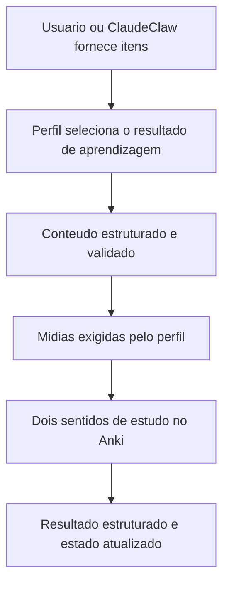

# Anki Automation V2 Foundation - Plan

## Goal Capsule

- **Objective:** tornar o Anki Automation uma base confiavel para criar cards de ingles e espanhol, com audio controlado, operacao independente e integracao futura com o ClaudeClaw, sem perder os dados ou a capacidade atual.
- **Product authority:** este plano cobre apenas a primeira entrega. Japones, fatos historicos e outros tipos de conhecimento aparecem como trabalhos relacionados, nao como escopo ativo.
- **Open blockers:** nenhum antes do planejamento. As escolhas tecnicas pendentes estao classificadas como `Deferred to Planning`.

---

## Product Contract

### Summary

A primeira entrega da V2 transforma o produto atual em um criador de cards configuravel para dois casos reais: vocabulario em ingles e frases de viagem em espanhol. Ela acrescenta audio somente aos cards novos, preserva o acervo existente e oferece tanto uso independente quanto uma entrada limpa para o ClaudeClaw.

### Problem Frame

A V1 entrega um bom fluxo para vocabulario em ingles, mas suas regras de conteudo, imagem, configuracao e processamento estao ligadas a esse unico caso. Essa especializacao torna a inclusao do espanhol fragil e deixa a futura integracao com o ClaudeClaw dependente de detalhes internos.

O projeto tambem guarda um acervo ja produzido que nao pode ser tratado como descartavel. A V2 precisa evoluir o produto sem refazer cards existentes, sem adicionar audio retroativamente e sem transformar a ambicao de suportar outros conhecimentos em uma estrutura generica sem casos concretos.

O estado local confirma 457 itens, mas nao representa cada item como um par confiavel. Existem 1.101 ocorrencias de identificadores para 973 identificadores unicos, um item registra 187 identificadores, outro registra quatro e ha uma imagem sem item correspondente. A criacao atual dos dois sentidos tambem usa operacoes separadas, portanto uma falha intermediaria pode deixar um resultado parcial.

### Key Decisions

- **Entregar a visao em etapas.** (session-settled: user-approved — chosen over uma unica entrega com todo o escopo: reduz o risco e permite validar cada ampliacao com uso real.) Governs R1, R2.
- **Validar a base com ingles e espanhol.** (session-settled: user-approved — chosen over uma plataforma universal desde o inicio: evita complexidade sem evidencia.) Governs R1, R2, R5.
- **Adicionar audio somente aos cards novos.** (session-settled: user-directed — chosen over atualizar retroativamente o acervo: controla armazenamento e evita retrabalho em massa.) Governs R11, R12.
- **Usar audio principal e no maximo um exemplo principal.** (session-settled: user-directed — chosen over narrar todos os exemplos: preserva o valor de pronuncia sem multiplicar os arquivos.) Governs R11, R13, R14.
- **Manter cards de idioma automaticos e reservar revisao para historia.** (session-settled: user-directed — chosen over uma politica unica de aprovacao: mantem rapido o fluxo de idiomas e protege o conteudo historico.) Governs R10.
- **Aceitar duas origens para historia no trabalho futuro.** (session-settled: user-directed — chosen over apenas material fornecido ou apenas pesquisa por tema: preserva flexibilidade e procedencia visivel.)
- **Criar uma pergunta principal por fato historico no trabalho futuro.** (session-settled: user-directed — chosen over quantidade adaptativa ou multiplas perguntas fixas: reduz repeticao e mantem cada card focado.)

### Requirements

**Product shape**

- R1. A primeira entrega deve suportar dois perfis reais sem edicao de codigo: vocabulario em ingles e frases de viagem em espanhol.
- R2. A configuracao deve expressar apenas variacoes comprovadas por esses perfis, mantendo aberta a ampliacao futura sem prometer suporte abstrato a qualquer tipo de conteudo.
- R3. O produto deve continuar funcionando sozinho por linha de comando para uma entrada ou um lote.
- R4. O produto deve oferecer uma entrada programatica com solicitacao, resultado e erros estruturados para uso futuro pelo ClaudeClaw.

**Generation and profiles**

- R5. O provedor de geracao de texto deve ser selecionavel por configuracao entre opcoes Anthropic e OpenAI que cumpram o mesmo contrato de resultado.
- R6. O conteudo gerado deve seguir uma estrutura validavel, sem depender de titulos ou marcadores textuais para separar campos.
- R7. Cada perfil deve definir seu objetivo de aprendizagem, conteudo esperado, midias aplicaveis, deck e etiquetas sem exigir alteracao da logica central.

**Language card behavior**

- R8. O perfil de ingles deve preservar dois sentidos de estudo, imagem conceitual sem texto e qualidade de conteudo igual ou melhor que a V1.
- R9. O perfil de espanhol deve criar dois sentidos de estudo para frases de viagem, incluindo traducao e contexto de uso, com imagem opcional.
- R10. Cards de idioma aprovados pelo proprio processamento devem entrar no Anki sem uma etapa manual de revisao previa.
- R11. Cada card novo de idioma deve ter audio para a palavra ou frase principal e pode ter audio para um exemplo principal.
- R12. Cards e registros existentes nao devem receber audio retroativamente nesta entrega.
- R13. Os dois sentidos de estudo devem reutilizar as mesmas midias quando pertencem ao mesmo item.
- R14. Antes de um lote com impacto material de midia, o produto deve mostrar uma estimativa simples do armazenamento adicional.

**Data safety and reliability**

- R15. Os 457 itens processados informados como estado atual devem ser preservados por migracao ou reconciliacao, nunca descartados.
- R16. A migracao de estado nao deve alterar os cards que ja existem no Anki.
- R17. O estado atual deve ser auditado antes de virar fonte confiavel, e inconsistencias devem ser expostas sem sobrescrita silenciosa.
- R18. A criacao dos dois sentidos de estudo deve ser tratada como um unico resultado logico, sem marcar um item incompleto como concluido.
- R19. Uma falha em um item nao deve impedir o restante do lote, mas deve deixar o item falho identificavel para nova tentativa segura.

<!-- ce-section: work-relationships -->
### How This Work Fits Together

Este plano possui somente a fundacao e a primeira entrega de idiomas. A divisao abaixo e o entendimento atual e pode ser revista por planos futuros.

- **Etapa 1 — fundacao, ingles e espanhol:** e o trabalho ativo deste plano.
  - **Enables:** perfis posteriores reutilizam a entrada estruturada, o tratamento de midia, o estado seguro e a integracao externa.
- **Etapa 2 — japones:** depende da fundacao e acrescenta escrita, leitura, significado, exemplos e audio de pronuncia.
  - **Still to decide:** regras de transliteracao, escrita esperada e desenho exato dos sentidos de estudo.
- **Etapa 3 — fatos historicos:** compartilha a base configuravel, mas acrescenta pesquisa com fontes e revisao humana obrigatoria antes do Anki.
  - **Shares:** pode partir de material fornecido pelo usuario ou de pesquisa por tema com fontes visiveis.
  - **Still to decide:** apresentacao de data, contexto, imagem ou mapa e formato da tela ou artefato de revisao.
- **Etapa 4 — novos tipos de conhecimento:** depende de casos reais adicionais e nao deve criar um framework especulativo antes deles.

### Actors

- A1. **Usuario:** fornece itens ou lotes, escolhe o perfil e recebe resultados e falhas compreensiveis.
- A2. **ClaudeClaw:** no futuro aciona o mesmo produto por uma entrada estruturada, sem conhecer seus detalhes internos.
- A3. **Anki:** recebe notas, cards e midias e continua sendo o sistema de estudo.
- A4. **Provedores externos:** geram texto, imagem ou audio sob contratos que o produto consegue validar.

### Key Flows

- F1. **Standalone language creation**
  - **Trigger:** A1 solicita uma entrada ou lote com um perfil de idioma.
  - **Actors:** A1, A3, A4.
  - **Steps:** o produto valida a configuracao, gera o conteudo e as midias aplicaveis, cria os sentidos de estudo e registra o resultado.
  - **Covered by:** R1, R3, R5-R14, R18, R19.
- F2. **ClaudeClaw-ready creation**
  - **Trigger:** A2 envia uma solicitacao estruturada.
  - **Actors:** A2, A3, A4.
  - **Steps:** o produto executa o mesmo fluxo de perfil e devolve sucesso ou falha em formato estruturado.
  - **Covered by:** R4-R14, R18, R19.
- F3. **Existing-state transition**
  - **Trigger:** a V2 e preparada para usar o estado produzido pela V1.
  - **Actors:** A1, A3.
  - **Steps:** o produto inventaria o estado, aponta inconsistencias, preserva os cards existentes e somente entao estabelece o novo estado confiavel.
  - **Covered by:** R15-R17.

### Acceptance Examples

- AE1. **Covers R8, R10, R11, R13.** Dada uma nova palavra em ingles, quando o perfil conclui o processamento, entao o Anki recebe os dois sentidos com a imagem conceitual e o mesmo audio principal reutilizado.
- AE2. **Covers R9-R11.** Dada uma nova frase de viagem em espanhol, quando a imagem esta desativada no perfil, entao os dois sentidos sao criados com traducao, contexto e audio sem exigir imagem ou revisao manual.
- AE3. **Covers R12, R15, R16.** Dado um item ja processado antes da V2, quando o estado e migrado, entao seu card permanece inalterado e nenhum audio retroativo e criado.
- AE4. **Covers R14.** Dado um lote com impacto material de midia, quando o usuario inicia o processamento, entao recebe antes uma estimativa compreensivel do espaco adicional.
- AE5. **Covers R5, R6.** Dado outro provedor de texto configurado, quando ele produz conteudo valido, entao o restante do fluxo recebe a mesma estrutura esperada pelo perfil.
- AE6. **Covers R17.** Dada uma inconsistencia entre o estado local e o Anki, quando a reconciliacao ocorre, entao o conflito e apresentado sem apagar ou substituir dados silenciosamente.
- AE7. **Covers R18, R19.** Dada uma falha depois da criacao de apenas um sentido de estudo, quando o lote continua, entao o item nao e marcado como concluido e pode ser recuperado sem duplicacao silenciosa.

### Success Criteria

- O fluxo completo cria e verifica de duas a tres entradas reais de ingles e de duas a tres entradas reais de espanhol com o Anki aberto.
- O perfil de ingles mantem a capacidade e a qualidade percebida da V1.
- O perfil de espanhol produz cards uteis para as frases de viagem sem mudanca de codigo.
- O mesmo pedido pode ser executado pela linha de comando e pela entrada preparada para o ClaudeClaw.
- A troca entre provedores suportados exige configuracao, nao alteracao do fluxo de produto.
- A migracao preserva o acervo existente e deixa inconsistencias conhecidas visiveis.
- O planejamento quantifica o impacto de armazenamento do audio em lotes representativos antes de recomendar os padroes de qualidade.

### Scope Boundaries

- Japones, fatos historicos e outros tipos de conhecimento ficam fora da entrega ativa e serao planejados separadamente.
- A integracao dentro do repositorio do ClaudeClaw fica fora de escopo; esta entrega prepara apenas o contrato de chamada.
- Interface grafica, painel de metricas e um agente que modifica o proprio software ficam fora de escopo.
- Audio retroativo para cards existentes fica fora de escopo.
- A primeira entrega nao promete uma plataforma universal para qualquer formato de card.

### Dependencies and Assumptions

- O Anki Desktop com AnkiConnect continua disponivel para os testes finais com cards reais.
- O acervo existente e o estado local podem conter inconsistencias e nao devem ser considerados autoritativos antes da reconciliacao.
- O repositorio nao possui hoje uma suite automatizada de testes; o planejamento precisa estabelecer cobertura proporcional aos fluxos e a migracao.
- As condicoes comerciais, limites e regras de uso de provedores e ferramentas de assinatura podem mudar e exigem pesquisa atual no planejamento.
- Qualidade de audio significa pronuncia inteligivel para estudo; tamanho de arquivo e custo precisam ser avaliados junto com essa qualidade.

### Outstanding Questions

**Deferred to Planning**

- Qual combinacao de API direta e ferramentas de assinatura oferece o melhor equilibrio atual entre confiabilidade, custo, limites e termos de uso?
- Qual provedor, formato e nivel de qualidade de audio entrega pronuncia adequada com crescimento de armazenamento aceitavel?
- Qual modelo de nota e de templates do Anki preserva os dois sentidos de estudo e reduz resultados parciais?
- Qual forma de armazenamento e migracao reconcilia o estado atual sem alterar cards existentes?
- Qual fronteira de provedor de imagem preserva a qualidade atual e reduz o impacto de futuras mudancas externas?

### Sources and Research

- `CLAUDE.md` — comportamento e restricoes documentados da V1.
- `HANDOVER.md` — caso real de espanhol e direcao ainda nao implementada de perfis.
- `roadmap.txt` — evolucao desejada para multiplas linguas e outros conhecimentos.
- `main.py` — fluxo atual de entrada, processamento, midia, Anki e cache.
- `modules/llm_provider.py` — geracao atual e dependencia de marcadores textuais.
- `modules/anki_connector.py` — criacao atual dos dois sentidos de estudo.
- `modules/image_provider.py` — comportamento atual de imagens e historico recente de mudanca externa.
- `config/settings.example.json` — configuracao publica atual do projeto.
- `docs/plans/2026-02-26-fix-update-dependencies-and-pollinations-api-plan.md` — precedente de migracao de provedor e teste real com Anki.
